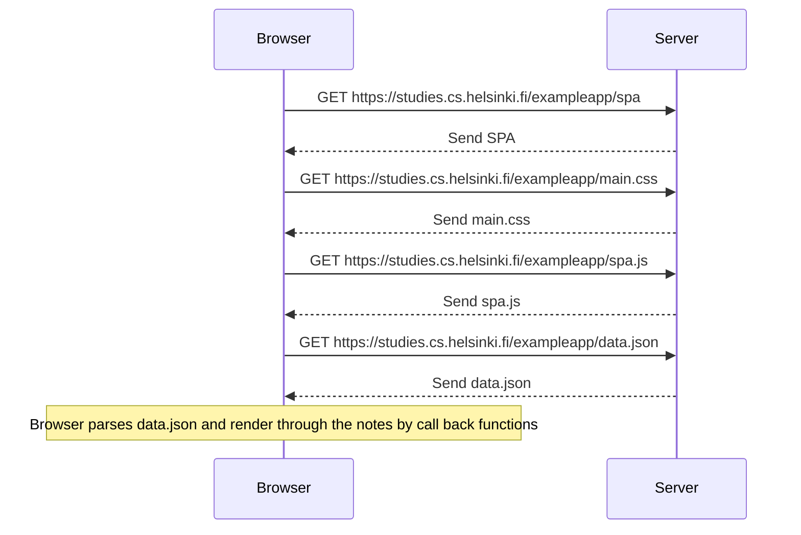
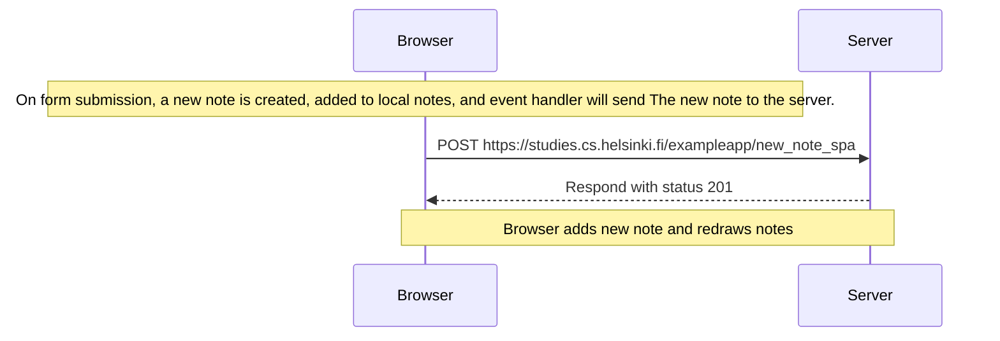

 04
 ```mermaid
 sequenceDiagram
    participant Browser
    participant Server
    Browser->>Server: HTTPS POST https://studies.cs.helsinki.fi/exampleapp/new_note
    Server-->>Browser: redirects to /notes
    Browser->>Server: HTTPS GET https://studies.cs.helsinki.fi/exampleapp/notes
    Server-->>Browser: HTML Document 
    Browser->>Server: HTTPS GET https://studies.cs.helsinki.fi/exampleapp/main.css
    Server-->>Browser: css file
    Note over Server, Browser :Browser executes the js file that fetches data.json
    Browser->>Server: HTTPS GET https://studies.cs.helsinki.fi/exampleapp/data.json
    Server-->>Browser: {.........content.........}
    Note over Server,Browser: Browser executes callback functions to render notes
```
05

06




